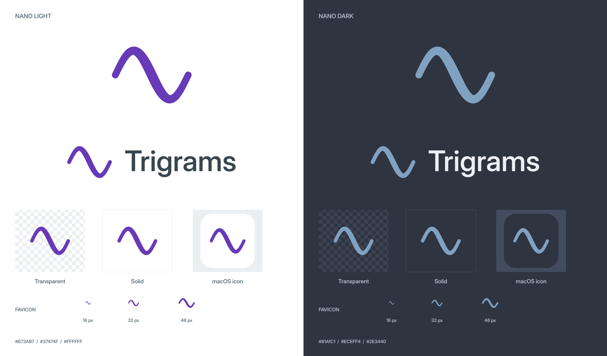

# Trigrams

A native macOS agent, built around pi's extensible harness and Apple's on-device Foundation Models.

**当前状态：首轮原生应用实现。完整兼容目标与尚待完成的能力见[实施状态](docs/implementation-status.md)。**

Trigrams 是通用的本地 agent。核心只保留原生界面、AFM 模型桥接和完整 pi 宿主；具体功能通过可读取、可安装、可组合的 skills、extensions 和 MCP 接入。App 不内置 macOS 自动化工具服务。

| 文档 | 内容 |
| --- | --- |
| [架构](docs/architecture.md) | pi SDK、Swift 服务、模型适配、工具边界、会话与数据 |
| [pi 能力兼容](docs/pi-compatibility.md) | 上游能力对应表、skills 规则、扩展 UI 兼容与验收 |
| [界面设计](docs/design.md) | 聊天列表、聊天框、自定义控件、Phosphor 图标、Nano 深浅配色 |
| [品牌与数学标志](docs/brand/README.md) | Sine 标志、Nano 两套配色、字标、app icon、favicon 与完整物料包 |
| [评审与实施顺序](docs/review.md) | 本轮需要确认的决策、验证项与阶段验收 |
| [参考资料](docs/references.md) | 上游版本快照与官方资料 |
| [System prompt](docs/system-prompt.md) | 可编辑的基础提示词与 pi 上下文的组合方式 |
| [测试](docs/testing.md) | 真实进程 E2E、原生 UI E2E、覆盖率门槛与 Codecov |
| [构建与分发](docs/distribution.md) | 自带 Node/pi、GitHub Actions、签名与 Store 候选配置 |
| [IPC](protocol/README.md) | Swift 与 pi 的本地推理、事件和扩展 UI 契约 |

## Development

Requires macOS 26+, Xcode 26+, and an Apple Intelligence-capable Mac for actual on-device inference. Trigrams bundles its pinned Node/pi runtime; launching the built app does not require a global Node installation.

```sh
scripts/bootstrap.sh
scripts/build.sh community Debug
scripts/test.sh
```

Open `apps/Trigrams/Trigrams.xcodeproj` after bootstrap. Build artifacts and temporary dependencies live in the worktree's ignored `build/` directory. Local development scripts require an SSD-backed worktree under `/Volumes/SSD/Developer`.

Settings manages `System`, `Nano Light`, and `Nano Dark`, the editable system prompt, and standard skill directories. Skills and `AGENTS.md` keep upstream pi formats and discovery behavior. The AFM provider performs inference only; pi owns tool execution and the persistent session tree.

CI uses GitHub Actions with process/UI E2E and a measured coverage gate above 80%. The DEBUG test fixture replaces model inference while retaining the real app, transport and pi runtime. Community archives are self-contained; the separate Store scheme is a sandbox validation candidate whose executable runtime is disabled pending policy validation.



品牌素材包含 Nano 两套配色的透明与实底标志、字标、app icon、favicon、社交卡片及可重复运行的数学生成代码。
