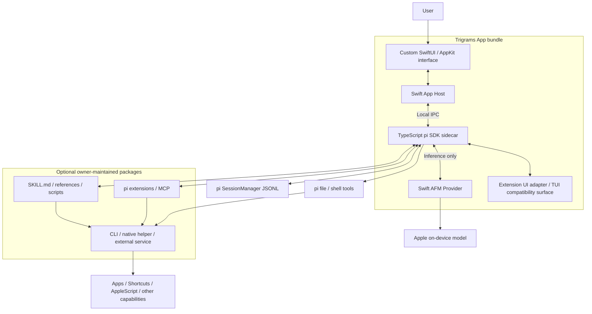

# Trigrams 架构提案

状态：已进入首轮实现。日期：2026-10-04。当前方案：最小宿主，领域能力通过可插拔包交付。兼容契约中的目标逐项验证，不代表所有能力已经完成。

## 1. 产品边界与原则

Trigrams 是一个 macOS 通用本地 agent，拥有原生桌面界面。用户通过 pi 的文件与 shell 工具，以及可安装的 skills、extensions 和 MCP 接入工作能力。使用应用、Shortcuts、AppleScript 等是可插拔能力，编码只是用途之一。

架构遵循 pi 的组织方式：保留小而通用的运行核心，将具体工作方法放入 skills，将新增机制放入 extensions，将可执行能力注册成 tools。计划模式、多 agent、领域专家和工作流都可以由扩展提供，不成为所有任务必须经过的内置流程。[pi 上游](https://github.com/earendil-works/pi)

以下是本方案的硬约束：

- 直接复用完整 pi SDK；agent loop、会话树、资源加载和扩展生命周期以 pi 为准。
- Apple Foundation Models（AFM）是默认的本地推理后端；pi 决定何时调用工具。
- Swift 只实现原生界面、AFM 模型桥接和必要的应用生命周期；TypeScript 负责 pi 宿主适配。
- 能由标准 skill、脚本、extension 或 MCP 提供的功能，不放入 App 核心，也不要求随 App 捆绑。
- skills 是主要功能交付形式。需要可执行程序或结构化工具时，由 skill owner 的配套脚本、extension 或 MCP 提供。
- 能力兼容按机制和行为验收；不能将不支持的扩展接口悄悄变成空操作。
- 默认本地运行；网络服务和其他模型可以通过 pi 接入，由用户明确启用。

“完整 pi 能力”与“默认模型能够胜任所有任务”需要分别验证。框架能够加载工具和 skills，并不说明一个小型本地模型可以可靠完成任意长任务。

## 2. 最小 App 边界



| App 内的职责 | 最小实现 | 不能扩展成的领域功能 |
| --- | --- | --- |
| 界面 | 自定义聊天、输入、消息、资源入口、必要的扩展 UI | 特定应用工作流、领域管理页面 |
| 模型桥接 | AFM availability、生成、schema、stream、取消 | 系统工具执行、第二套 agent loop |
| pi 宿主 | SDK 生命周期、配置、资源发现、IPC、事件投影 | 重写 skills、工具库和工作流引擎 |
| 会话呈现 | 使用 pi JSONL；少量可重建的列表索引 | 独立的权威聊天数据库 |
| 分发与生命周期 | 打包 Node/pi、签名、退出与恢复 | 通用依赖安装器、外部 helper 管理框架 |

**首版不实现 `swift-native-capability`，不提供 `trigramsctl`，不打包 macOS 工具服务，不建立 App 级桌面执行协调器。** 这些都不是 AFM 或 pi 的必要前提。

可选包可以由 Trigrams 作者或第三方维护，但它们使用同样的标准入口、独立版本和安装选择，不获得核心特权，也不成为 App 启动依赖。功能的重要程度决定其包的质量与维护优先级，不自动决定它应该进入 App。

pi 的上游快照使用 `@earendil-works/pi-coding-agent`、`pi-agent-core`、`pi-ai` 等包名。版本依据见[参考资料](references.md)。实施时锁定实际发布版本，不自动跟随 `main`。

## 3. 为什么采用完整 SDK

只接 `pi-agent-core` 会使 Trigrams 自行实现资源发现、skill 命令、会话持久化、compaction、扩展事件、包管理和模型配置，逐渐形成第二套行为。

默认使用 `createAgentSession`、`DefaultResourceLoader`、`SessionManager` 等 SDK 入口，并在这些入口周围增加宿主适配。CLI 的内置命令需要在原生前端显式映射；它们不会因为使用 SDK 就自动出现在聊天框中。[SDK 文档](https://github.com/earendil-works/pi/blob/200387122ca450d6387f033949423114a270b96c/packages/coding-agent/docs/sdk.md)

SDK 会话也不会自动加载 CLI 的 MCP、codemode 和 tool-search 内置扩展。宿主必须按上游方式注册相应 extension factories、启用对应 tools，并绑定扩展生命周期。缺少这一步不满足兼容目标。

禁止在 Swift 中复制一套 planner 或独立 agent loop。Swift 只持有运行状态投影，不能自行在 tool result 之后再请求模型。

## 4. AFM 作为推理 Provider

### 单次请求

AFM 的 `LanguageModelSession` 可以不注册任何可执行 `Tool`，直接用于文本或结构化生成。Trigrams 采用这条路径。AFM 输出的是“回答或拟调用工具”的数据，随后由 pi 验证并执行调用。[Apple：LanguageModelSession](https://developer.apple.com/documentation/foundationmodels/languagemodelsession)

```mermaid
sequenceDiagram
    participant Pi as pi runtime
    participant Bridge as TS provider adapter
    participant Swift as Swift AFM service
    participant Tool as pi tool / extension executor
    Pi->>Bridge: context + tools + generation options
    Bridge->>Swift: model.generate(requestId, payload)
    Swift->>Swift: AFM generation; no executable Tool registration
    Swift-->>Bridge: partial output / final action data
    Bridge-->>Pi: pi assistant events + final message
    Pi->>Tool: execute validated tool call
    Tool-->>Pi: result
    Pi->>Bridge: next inference with updated context
```

拟议生成协议允许 `answer` 和 `tool_calls` 两种结束结果。工具参数用受支持的动态 schema 表达；在 pi 执行前仍按原工具 schema 再验证一次。schema 无法无损转换时返回明确的兼容错误，不能删除约束后照常执行。[Apple：guided generation](https://developer.apple.com/documentation/foundationmodels/generating-swift-data-structures-with-guided-generation)

模型生成的 tool-call ID 由适配层分配并与 pi 记录对应。部分生成中的参数只用于显示预览；只有完整且验证通过的调用可以执行。AFM 的增量快照需要转换成 pi 的增量事件，避免重复追加已经显示的文本。

### 上下文所有权

pi 的当前会话分支是上下文来源。每次推理使用该来源构造 AFM 请求；不能同时保留 AFM 内部历史，再把同一段 pi 历史重复追加进去。

初始实现优先为每次推理建立新的 AFM session，保持语义明确。之后如引入复用或 prewarm，缓存必须由上下文哈希、模型配置和 session revision 标识，失效规则不能依赖 UI 聊天选择状态。

工具调用和结果需要由适配层确定性编码为模型可理解的历史表示。文件、网页、应用文字等外部内容应保留来源边界；不能将工具结果提升为系统指令。分支切换、compaction、模型切换后都从新的 pi context 重建。

### 能力与资源限制

Apple 当前文档给出的 system model 上下文预算为 4,096 tokens，且包含指令、输入和输出。这使资源发现和工具输出大小成为核心设计问题。[Apple：context limits](https://developer.apple.com/documentation/FoundationModels/generating-content-and-performing-tasks-with-foundation-models)

处理方式：

- 按 pi 的方式渐进加载 skills；不要把所有 SKILL.md 放入系统提示。
- 大型工具目录使用兼容的工具发现机制；单次只提供有用的工具定义。
- 核心保留 pi 的输出处理；可选包自行对大型文件、AX 树、OCR 等输出提供分页和引用。
- 保留 pi compaction；根据 AFM 的有效预算配置阈值和输出余量。
- schema、系统指令或单条不可分割输入本身超限时直接报告，不通过无限压缩循环掩盖。

上下文长度是 provider metadata，不是全局常量。新系统版本新增模型能力时，按实际 API 和设备验证后启用。图片输入、思考级别、token usage 等不支持的能力不能伪造；界面显示 `Unavailable` 或 `Unknown` 并说明原因。OCR 是可选工具产物，不能冒充视觉模型输入。

启动时检查模型 availability 和所需系统能力。暂定最低支持 macOS 26、Apple Intelligence 可用设备；最终支持范围由验证阶段决定。模型不可用时保留浏览会话和配置的能力，不自动改用云模型。其他 pi providers 仍是可选能力。

### 取消与失败

取消按 request ID 传到 Swift Task；迟到的结果不能写入已经取消或替换的推理。模型不可用、生成拒绝、上下文超限、schema 不兼容和传输失败分开返回，交给 pi 的相应处理路径。只对可恢复错误采用有上限的重试。

## 5. 功能通过什么方式接入

“通过 skills 可插拔”是产品组织原则；标准 pi 已经提供多种承载执行逻辑的机制，无需再设计一套 Trigrams 插件格式。

| 包内元素 | 负责 | 例子 |
| --- | --- | --- |
| `SKILL.md` | 使用条件、工作方法、调用方式 | 什么时候使用某个 Shortcut，如何理解结果 |
| references / assets | 按需读取的知识与模板 | AppleScript 字典说明、应用操作指南 |
| scripts / CLI / helper | 真正执行动作 | `shortcuts`、`osascript`、Node/Python 脚本、独立 Swift 程序 |
| pi extension | tools、commands、hooks、UI、provider 等注册 | 把 helper 包装为有 schema 的结构化工具 |
| MCP server | 独立进程或外部服务的工具与资源 | 一个提供应用操作能力的本地 server |

简单功能可以只有 skill + shell 命令；需要更稳定的工具契约或常驻服务时，再增加 extension 或 MCP。并不是每个 skill 都必须带后两者。

例如一个 Shortcuts skill 可以指导 agent 使用系统现有 `shortcuts` 命令；一个应用脚本 skill 可以携带 `.applescript` 文件并通过 `osascript` 执行。需要 Accessibility 的 owner 可以实现自己的 Swift helper，再通过脚本、extension 或 MCP 调用。**App 不需要先拥有这些能力，skill 才能使用它们。**

### 包作者的责任

包作者负责可执行代码、依赖、版本、支持系统、权限说明、超时、取消、结果与诊断。由执行方提供结构化工具时，遵循 pi 的 schema、`content` / `details` 和扩展生命周期。App 统一显示 pi 已有的工具事件，不为每类工具写适配器。

涉及签名 helper 或 macOS 权限时，owner 应验证真实调用路径下的 TCC 归属。权限可能受 helper 签名与启动方式影响；将一个程序放在 skill 目录中并不会自动授予权限。这是该能力包的可用性条件，不要求核心增加一个通用原生服务。

若实际执行路径需要宿主的签名配置，只增加必要的宿主元数据。例如 Apple Events 的 entitlement 与 usage description 属于签名应用配置，不能靠加载一个 SKILL.md 动态加入。[Apple Events entitlement](https://developer.apple.com/documentation/bundleresources/entitlements/com.apple.security.automation.apple-events)，[usage description](https://developer.apple.com/documentation/bundleresources/information-property-list/nsappleeventsusagedescription)。这不要求把能力包的执行代码搬进 App。

需要串行桌面操作的包可以自行加锁或提供可选协调扩展。App 不宣称不同包已经共享一个全局执行队列。没有具体需求时，不提前建立跨包调度机制。

## 6. Skills 与 packages 的组织

保留 pi 的资源发现、`/skill:name`、模板和 `/reload` 语义；完整要求见[能力兼容文档](pi-compatibility.md)。具体工作流的默认交付单位是 skill；增强执行机制的单位是 extension 或 MCP。

下面是一个由 owner 独立分发的可选包示例；不是 Trigrams App 的构建依赖：

```text
owner-macos-package/
  skills/
    shortcuts/SKILL.md
    app-scripting/
      SKILL.md
      scripts/export.applescript
  extensions/             # 仅在需要注册工具等能力时添加
  package.json            # 标准 pi package manifest
```

复杂包可以增加自带 CLI、原生 helper 或 MCP server；使用者按该包的安装说明配置。语言由 owner 选择，Trigrams 不要求全部使用 Swift，也不要求调用 App 的私有服务。

保留 npm / git / 本地 package 来源和 pi 的安装更新机制。首版 App 不捆绑领域能力包，不增加第二套依赖安装和权限管理系统。用户资源与项目资源保留标准格式；项目代码加载前保留 pi trust 流程。Skills 页面展示路径、来源、加载状态和上游诊断。

## 7. 扩展 UI 的完整兼容

`select`、`confirm`、`input`、`editor` 等语义交互映射为自定义原生控件。status、字符串 widgets、编辑器文本和通知也有对应宿主接口。

任意 `pi-tui` component、custom editor、header/footer、终端输入 hook 和主题接口不能由通用 JSON RPC 自动转换。原版 RPC mode 会对部分接口返回空结果或不支持，因此不能直接将 `pi --mode rpc` 当作完整兼容方案。[扩展 UI 类型](https://github.com/earendil-works/pi/blob/200387122ca450d6387f033949423114a270b96c/packages/coding-agent/src/core/extensions/types.ts)，[RPC UI 范围](https://github.com/earendil-works/pi/blob/200387122ca450d6387f033949423114a270b96c/packages/coding-agent/docs/rpc-extension-ui.md)

拟采用 SDK 宿主 UI adapter，外加自定义原生终端兼容视图。组件 factory 在同一 sidecar、同一 pi session 中执行，终端绘制帧与输入由兼容视图承载。不能另开一个独立 CLI agent，导致上下文和工具记录分裂。

带终端专属接口的扩展需要能够看到合适的 `ctx.mode`，以及真实的 TUI、theme、keybindings、dispose 和 overlay 生命周期。仅返回 `hasUI = true` 不足以实现兼容。普通聊天仍由原生组件呈现。

**这是实施前必须通过的技术验证项。** 若 SDK 公共接口不能完成挂接，优先做范围明确的上游 adapter 或小补丁。不能在没有评审的情况下删掉 TUI 功能，也不能为此复制整套 pi。主题和终端键绑定作用于扩展视图；应用主界面使用 Trigrams 深浅主题。

## 8. IPC 与生命周期

初始 transport：应用启动自带 Node sidecar，通过私有 Unix domain socket 进行版本化 JSONL 通信。socket 位于当前用户的受限 runtime 目录，启动握手验证短期凭证。stdout/stderr 留给扩展输出和诊断，不与协议混用，避免插件日志破坏 IPC。消息必须限制大小、支持背压；没有对外 TCP 监听端口。

| 消息族 | 示例 | 要求 |
| --- | --- | --- |
| 初始化 | `hello`、`capabilities` | 协议版本、pi 版本、模型与宿主 UI 能力 |
| 聊天命令 | `session.prompt`、`steer`、`followUp`、`abort`、`fork` | chat ID 与 request ID；遵循 pi 状态转换 |
| 运行事件 | assistant、tool、compaction、retry、settled | 单调序列号；消息快照用于恢复 |
| 模型桥接 | `model.generate`、`model.delta`、`model.done` | generation ID；最后结果为权威消息 |
| 扩展 UI | `ui.request`、`ui.reply`、兼容绘制帧 | UI request ID、焦点、超时与 dispose |

事件用 `(backendInstance, chatID, sequence)` 去重；chat projection revision 用于避免旧状态覆盖新状态。大附件不经 JSONL 传 base64，使用 app 管理的文件引用并验证访问范围。App 的 IPC 只服务自身的 pi/UI/模型桥接；可选能力包不需要接入这个私有通道。

完整消息以 pi `message_end` 为准；运行完成以 `agent_settled` 为准，不能用一次 `agent_end` 就把仍会自动恢复的任务标记完成。

崩溃后从 pi JSONL 重建聊天状态。中断中的工具显示为 `Interrupted`，不能凭聊天记录自动重新执行有副作用的动作。显式继续从最新真实结果开始。清理时取消任务、关闭资源连接、dispose 扩展 UI，再终止 sidecar。

## 9. 数据与配置

```text
~/Library/Application Support/Trigrams/
  pi-agent/             # 标准 pi agentDir 结构，sessions/settings/resources
  host-index/           # 可重建的聊天摘要、搜索与 UI 投影
  artifacts/            # 工具输出、附件和导出文件
  logs/                 # 有轮转的本地诊断
  runtime/              # 版本与恢复元数据
```

pi `SessionManager` 的 JSONL 树是会话唯一事实来源，保留分支、compaction、扩展 entries 和自定义消息。不要在 Swift 数据库另存一套“真正聊天历史”。索引丢失可从 pi 会话重建。[会话格式](https://github.com/earendil-works/pi/blob/200387122ca450d6387f033949423114a270b96c/packages/coding-agent/docs/session-format.md)

Trigrams 默认使用自己的 `agentDir`。用户可以显式导入或选择现有 pi 配置；不能首次启动就修改 `~/.pi/agent`。项目的 `.pi`、`.agents` 和上下文文件仍按上游规则发现。无项目聊天使用明确的默认工作目录；工具执行时界面始终显示实际 cwd。

直接保留 pi provider/auth 的配置与存储语义，首版不新增独立 Keychain adapter。AFM 默认路径不需要 API key。默认无远程遥测；导出、分享和问题报告由用户明确发起。

## 10. 权限与分发

App 只检查核心运行所需的 AFM availability。Accessibility、Automation、Screen Recording 等领域权限由实际能力包按需处理；首版不预先请求这些权限，也不建立 App 内的全局权限中心。包返回的失败和说明可以通过 pi 工具结果或扩展 UI 呈现。

pi extensions、skill scripts 和 bash 按上游方式执行代码，保留资源来源与项目 trust。[pi security](https://github.com/earendil-works/pi/blob/200387122ca450d6387f033949423114a270b96c/packages/coding-agent/docs/security.md)

产品需要保留未来 Mac App Store 分发的方向。Store 构建与 Community 构建共用原生界面、推理边界和 pi 宿主代码，但不能将无限制执行外部代码的 Community 配置直接提交到商店。

Apple 要求 Mac App Store 应用启用 App Sandbox。审核规则 2.5.2 对下载、安装和执行改变应用功能的代码作出限制；沙盒还限制任意 Apple Events、Accessibility 和子进程的文件访问。这些规则与任意 pi extensions、skill scripts 和系统操作能力存在实质冲突。[审核规则](https://developer.apple.com/app-store/review/guidelines/)、[App Sandbox](https://developer.apple.com/documentation/security/protecting-user-data-with-app-sandbox)。因此，是否采用双发行配置以及 Store 版允许哪些资源，需要作为明确的产品决定，不能通过修改提示词解决。

首轮完整执行链使用 Community 配置。仓库预留独立 Store scheme、沙盒 entitlement 和 profile；Store 的可执行运行时在完成资源政策与沙盒验证前明确拒绝启动，不能宣称该构建已具备商店发行资格。后续需要验证随包审核的能力、声明式 skills、文件授权传递、签名和实际审核结果。发行配置不能让普通设置或下载的 skill 随意关闭沙盒。

Community 的 Developer ID 签名、公证以及 Store 的证书、provisioning、提交凭据通过 GitHub Actions 的环境 secrets 配置。可选 helper 的签名、依赖与分发属于其 owner；它们不随核心 App 一起签名或自动下载。详见[分发说明](distribution.md)。

## 11. 拟议代码组织与迭代准则

```text
apps/Trigrams/           # 自定义 SwiftUI / AppKit、AFM bridge、App 生命周期
agent/                  # 完整 pi SDK 的薄宿主、provider / UI adapter
protocol/               # App 与 pi 的必要 IPC 契约
docs/                  # 架构、设计、兼容要求与决策
```

目录已经按上述边界创建。领域能力包可以位于独立仓库；App 无需知道它们的具体工具和应用名称。

新增功能先判断能否通过现有的 skill、脚本、extension 或 MCP 完成。只有阻碍通用模型接入、pi 兼容或原生宿主使用的问题，才考虑修改核心。使用已有 pi 机制优先于新增 Trigrams 专有 API；不因为某个领域功能很重要就把其实现搬进 App。

每次 pi 升级按能力矩阵检查受影响机制，锁定依赖并保留兼容差异。完整 pi 能力的目标继续保留，最小化的是额外实现的领域功能。
