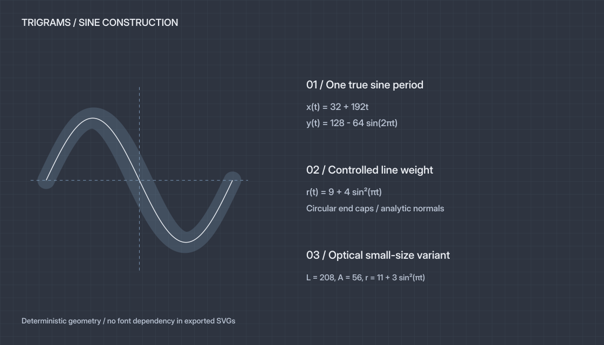

# Trigrams Brand Kit — Sine v1

状态：品牌物料已生成，供评审使用。应用实现尚未开始。

品牌标志采用一个完整的 sine 周期。参考用户提供的 `wave-sine-2.svg` 的波形方向，轮廓由真实 `sin` 函数重新生成，并加入圆端点、渐变线宽和小尺寸光学校正。


[下载完整物料包](Trigrams-Brand-Kit.zip) · [查看文件清单与校验值](asset-manifest.json)

## 1. 两套完整配色

Nano Light 与 Nano Dark 是两套完整配色；每套分别提供透明与实底导出。透明背景不改变该套的标志、字标颜色。

| 角色 | Nano Light | Nano Dark |
| --- | --- | --- |
| 背景 | `#FFFFFF` | `#2E3440` |
| 标志 / 强调色 | `#673AB7` 紫色 | `#81A1C1` 蓝色 |
| 字标 / 正文 | `#37474F` | `#ECEFF4` |
| 次级表面 | `#FAFAFA` | `#3B4252` |
| 区域分隔 | `#ECEFF1` | `#434C5E` |
| 可读辅助文字 | `#586C76` | `#B9C3D3` |

基础颜色来自此前选定的 Nano Emacs。辅助文字颜色沿用界面设计中的可读性调整。完整 tokens 见 [palette.json](palette.json) 和 [palette.css](palette.css)。黑白及 ink 版本用于单色场景，是额外导出。

## 2. 交付目录

```text
assets/
  logo/                  # 两套配色 × 透明 / 实底；ink 和纯黑白；SVG + PNG
  wordmark/              # 横向、上下组合、文字独立版；两套配色；SVG + PNG
  app-icon/              # 两套 macOS 图标；SVG、1024 PNG、ICNS、Xcode asset catalogs
  favicon/
    favicon.svg          # 按系统外观切换紫色 / 蓝色的透明 SVG
    light/               # 紫色 favicon、ICO、touch / web / maskable 图标
    dark/                # 蓝色 favicon、ICO、touch / web / maskable 图标
  pattern/               # 三相 sine 辅助图形；两套配色；SVG + PNG
  social/                # 1200 × 630 社交卡片；两套配色；SVG + PNG
source/inter/            # 锁定的字体与 OFL license；仅用于生成物料
```

`light` / `dark` 表示 Nano 配色；`transparent` / `solid` 表示有无背景。Xcode catalogs 属于物料交付，没有接入应用项目。

### 标志

| 文件 | 用途 |
| --- | --- |
| [Light / transparent](assets/logo/mark-light-transparent.svg) | 紫色标志，透明背景 |
| [Light / solid](assets/logo/mark-light-solid.svg) | 紫色标志，白色实底 |
| [Dark / transparent](assets/logo/mark-dark-transparent.svg) | 蓝色标志，透明背景 |
| [Dark / solid](assets/logo/mark-dark-solid.svg) | 蓝色标志，`#2E3440` 实底 |
| [Light ink](assets/logo/mark-light-ink.svg) / [Dark ink](assets/logo/mark-dark-ink.svg) | 对应主题的文字色单色标志 |
| [Black](assets/logo/mark-mono-black.svg) / [White](assets/logo/mark-mono-white.svg) | 印刷或受限颜色场景 |

每个 SVG 有同名 1024 × 1024 PNG。透明 PNG 保留 alpha；实底 PNG 整张不透明。根目录的 `trigrams-mark*.svg` 是主标志的便捷入口。

### 字标与组合

横向组合为默认完整标识；上下组合用于较窄空间。独立文字版用于标志已在同一画面出现的场景。

- [Horizontal Light](assets/wordmark/horizontal-light-transparent.svg) / [Horizontal Dark](assets/wordmark/horizontal-dark-transparent.svg)
- [Stacked Light](assets/wordmark/stacked-light-transparent.svg) / [Stacked Dark](assets/wordmark/stacked-dark-transparent.svg)
- [Wordmark Light](assets/wordmark/wordmark-light-transparent.svg) / [Wordmark Dark](assets/wordmark/wordmark-dark-transparent.svg)

上述组合均提供同名 `solid` 版本，以及宽 2048 px、保持比例的 PNG。字标使用 Inter v4.1，weight 550 / optical size 32，经过 kerning 后转为 SVG 轮廓，不需要查看者安装字体。

### macOS app icon

- [Light ICNS](assets/app-icon/Trigrams-Light.icns) / [Dark ICNS](assets/app-icon/Trigrams-Dark.icns)
- [Light 1024 PNG](assets/app-icon/trigrams-light.png) / [Dark 1024 PNG](assets/app-icon/trigrams-dark.png)
- [Light catalog](assets/app-icon/AppIcon-Light.appiconset/Contents.json) / [Dark catalog](assets/app-icon/AppIcon-Dark.appiconset/Contents.json)

使用预制圆角背景容器，外缘透明；两套各自包含 macOS 16 / 32 / 128 / 256 / 512 pt 的 1×、2×图像。交付的是两个可选资源集，实际应用的切换方式待界面实现阶段决定。

### Favicon 与网页图标

两套均提供：

| 文件 | 尺寸与用途 |
| --- | --- |
| `favicon.svg` | 透明矢量标志 |
| `favicon.ico` | 内含 16、32、48 px |
| `favicon-16.png` / `32.png` / `48.png` | 固定像素透明图标 |
| `apple-touch-icon.png` | 180 × 180，实底 |
| `icon-192.png` / `icon-512.png` | 192 / 512 px，实底网页图标 |
| `maskable-512.png` | 512 px，标志置于安全区 |
| `site.webmanifest` | 对应该套配色，图片引用使用相对路径 |

[Adaptive SVG](assets/favicon/favicon.svg) 使用 `prefers-color-scheme` 在紫色与蓝色之间切换。ICO、touch icon 和 manifest 是两套独立文件，部署时选择对应配色。

### 辅助物料

[Light social card](assets/social/og-light.png) / [Dark social card](assets/social/og-dark.png) 可用于链接分享，文案保持英文。标志不因应用场景变形。三相 sine pattern 是辅助背景，不替代主标志，也不叠到字标上。

## 3. 数学构造

主标志中心线与半线宽为：

```text
C(t) = (32 + 192t, 128 − 64 sin(2πt)),   0 ≤ t ≤ 1
r(t) = 9 + 4 sin²(πt)
```

根据解析切线计算单位法线 `N(t)`，两侧边界为 `C(t) ± r(t)N(t)`。端点以半圆连接，输出为实心 SVG 路径，避免不同渲染器的 stroke 行为差异。



favicon 的小尺寸版本使用 `L = 208`、`A = 56`、`r(t) = 11 + 3 sin²(πt)`，扩大横向占比并增加线宽。小尺寸资源保留同一个完整 sine 周期。

## 4. 使用规范

- 标志周围至少留一个端点直径的净空；组合标识使用已交付的比例和间距。
- 单标志建议至少 24 px；16 px 使用已做光学校正的 favicon。
- 横向组合建议至少 160 px 宽；空间更小时使用单标志。
- 标志使用对应 Nano 配色，字标使用该套文字色。对比不足时选实底版本或适当的单色版本。
- 不拉伸、旋转、加描边、阴影或重新组合。圆角、线宽和振幅从生成参数调整，全部物料一起重新生成。
- App 操作图标继续使用 Phosphor，品牌标志独立使用数学波形。

## 5. 重新生成

几何唯一来源：[generate-logo.swift](generate-logo.swift)。导出、字体轮廓、ICO、ICNS、manifest 和打包：[generate-brand.py](generate-brand.py)。字体来源记录：[provenance.json](source/inter/provenance.json)，许可：[OFL](source/inter/LICENSE.txt)。

生成环境需要 Swift、Python、rsvg-convert 与 macOS iconutil。Python 库仅用于品牌资产生成，版本见 [requirements.txt](requirements.txt)。先确认 SSD 挂载，在工作树执行：

```sh
export TMPDIR=/Volumes/SSD/Developer/Codex/tmp
export TMP=/Volumes/SSD/Developer/Codex/tmp
export TEMP=/Volumes/SSD/Developer/Codex/tmp
export PYTHONDONTWRITEBYTECODE=1
mkdir -p /Volumes/SSD/Developer/Codex/tmp
python3 -m pip install --no-cache-dir \
  --target /Volumes/SSD/Developer/Codex/tmp/trigrams-brand-deps \
  -r docs/brand/requirements.txt
PYTHONPATH=/Volumes/SSD/Developer/Codex/tmp/trigrams-brand-deps \
  python3 docs/brand/generate-brand.py
```

已下载的 Inter 源字体包含在物料包中，生成不需要再次下载字体。导出 SVG 全部包含轮廓，无外部图像、字体或网络依赖。`asset-manifest.json` 记录文件尺寸与 SHA-256；ZIP 包含物料、字体许可、代码和本说明。
